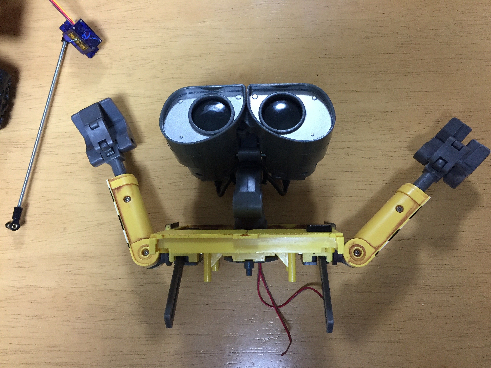

# Arms

<blockquote class="twitter-tweet">
WALL-E自立制御プロジェクト、遂に両腕と頭のサーボ化に成功。 マウンタの素材はいろいろ悩んだ結果、発泡スチロールで作成。 がっちりホールド出来てます。 リンク機構も良い感じ。 <a href="https://t.co/co3ZFASOGx">pic.twitter.com/co3ZFASOGx</a>
&mdash; Nabeshin (@desmoquattro996) <a href="https://twitter.com/desmoquattro996/status/891625194279780353?ref_src=twsrc%5Etfw">July 30, 2017</a></blockquote> 

## Index

* [00. starting](00_starting.md)
* [01. caterpillar](01_caterpillar.md)
* [02. speaker_radio](02_speaker_radio.md)
* [03. arms](03_arms.md)
* [04. wifi_eye_head](04_wifi_eye_head.md)
* [05. battery](05_battery.md)
