# WiFi

* It was replaced to RasPiZero W

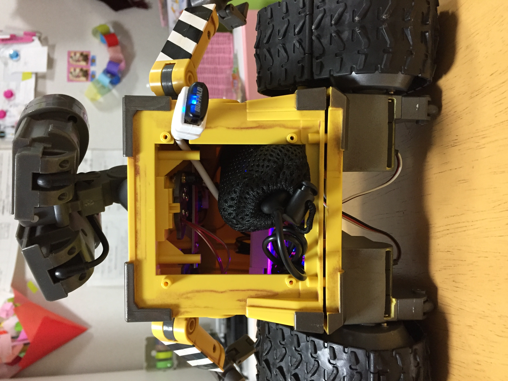

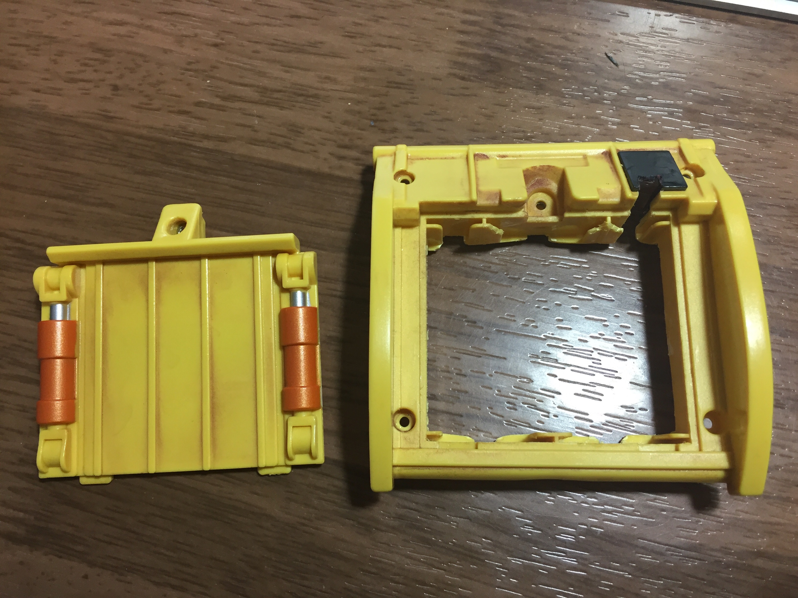

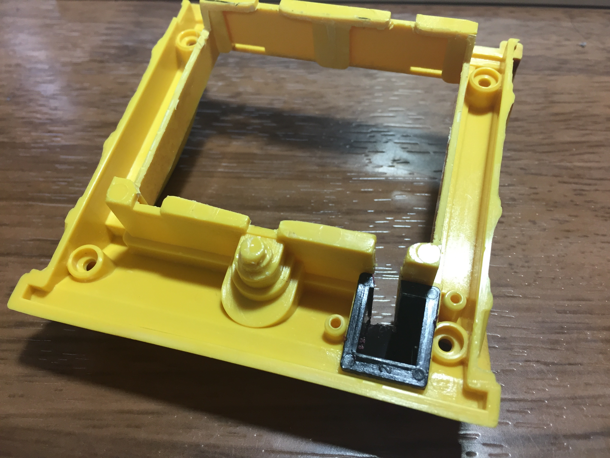

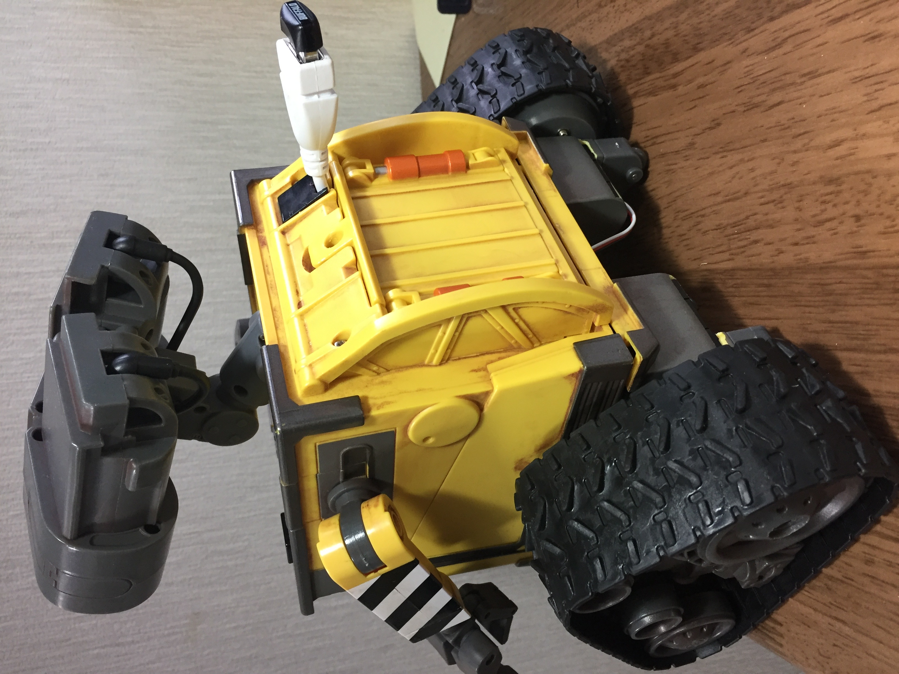

# Power Switch

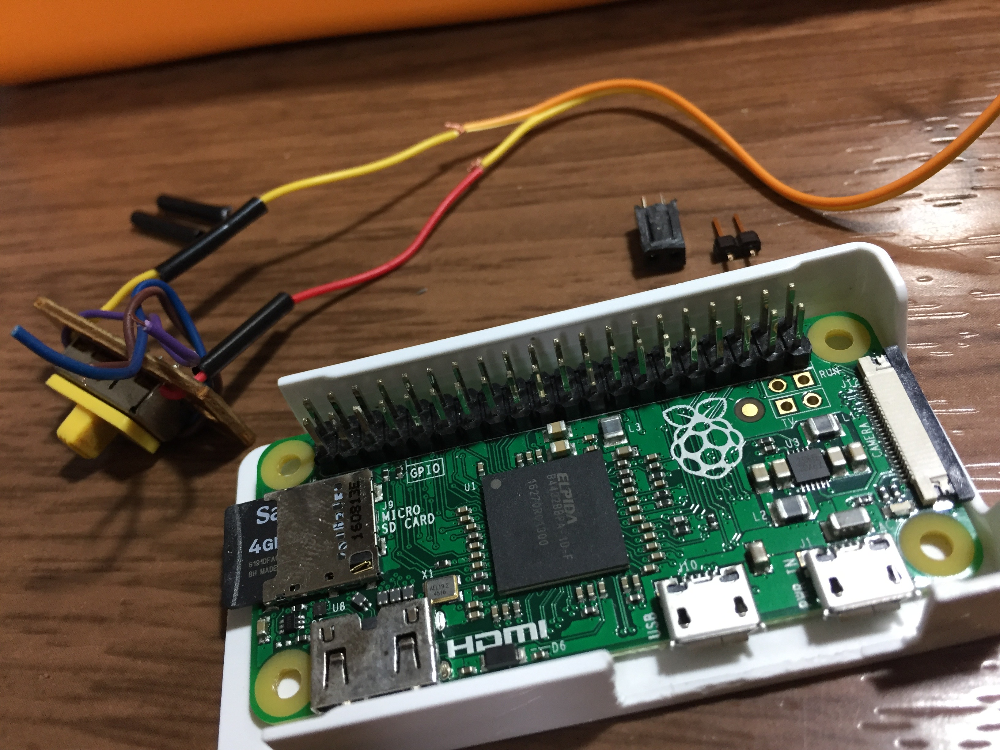

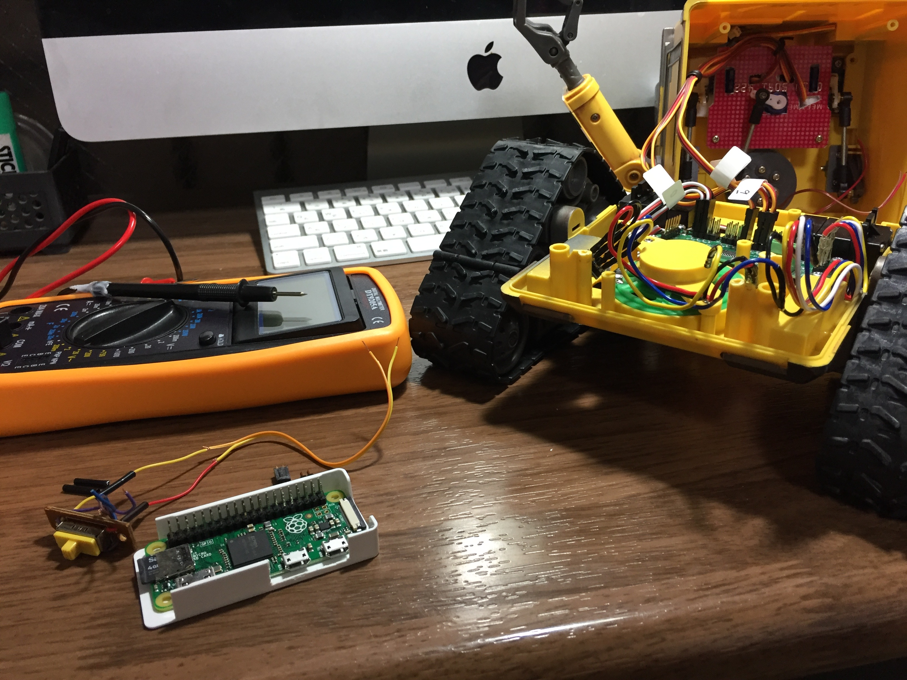

# Eye light

# Head

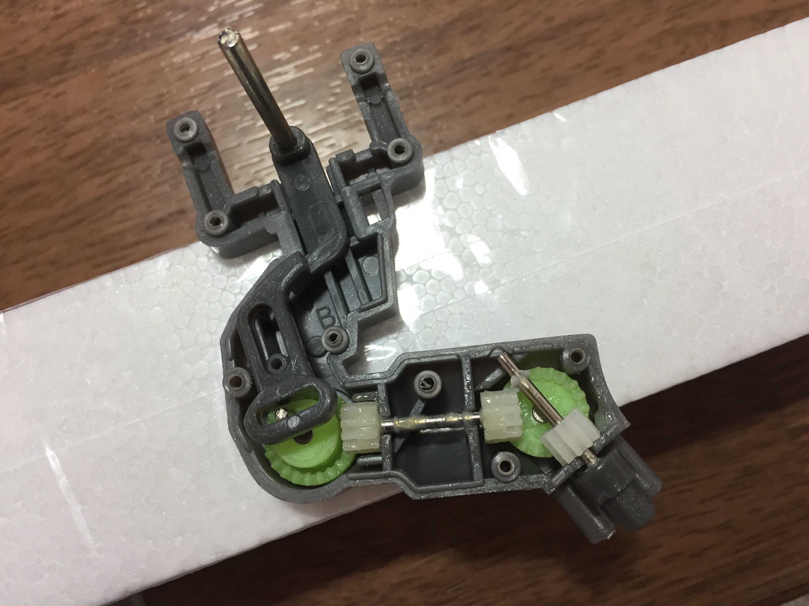

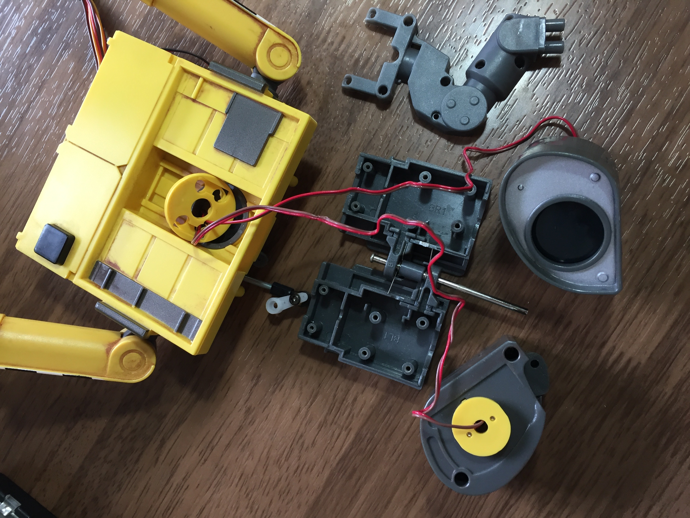

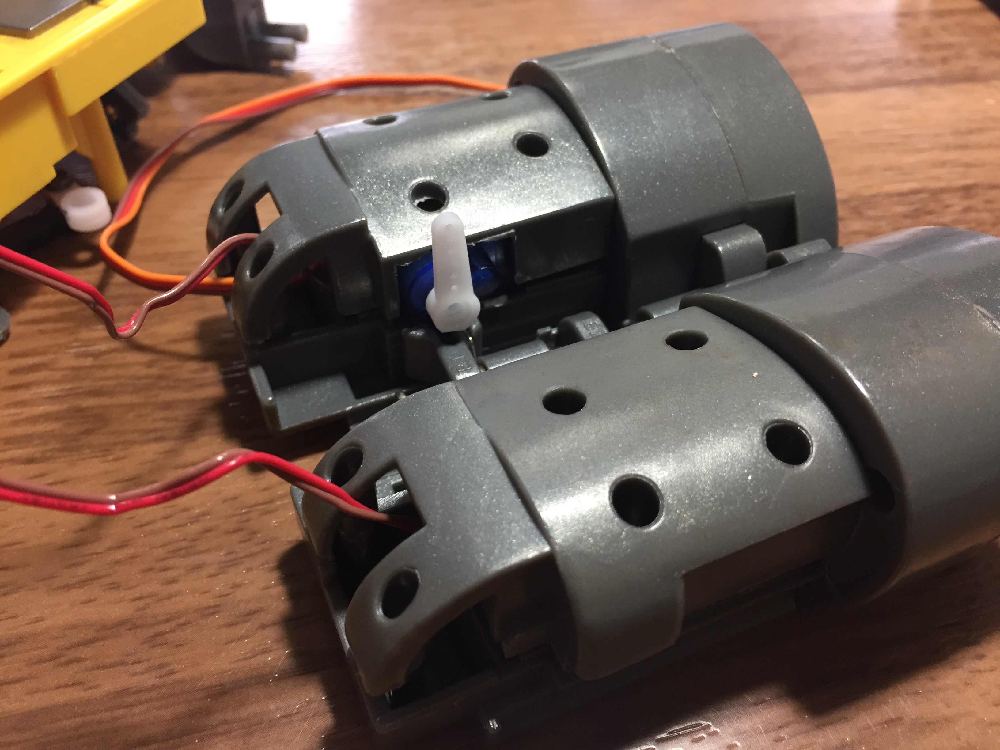

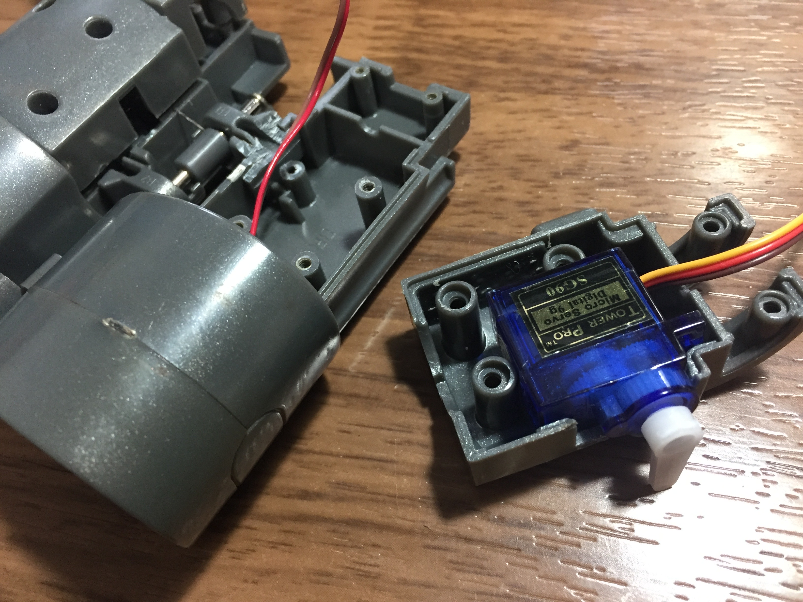

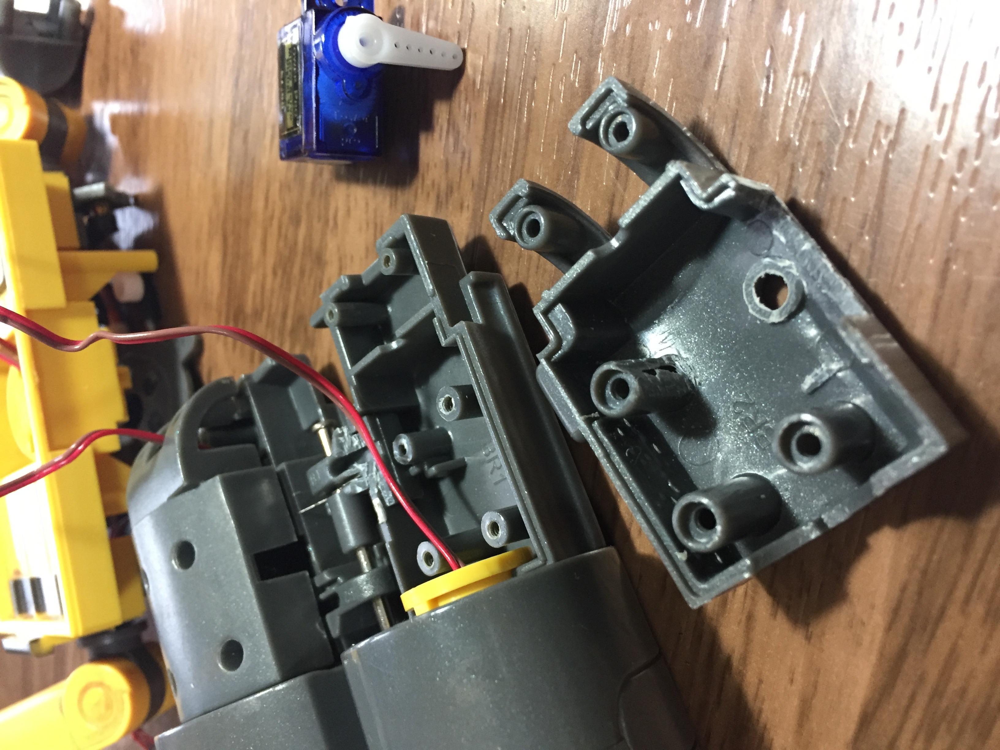

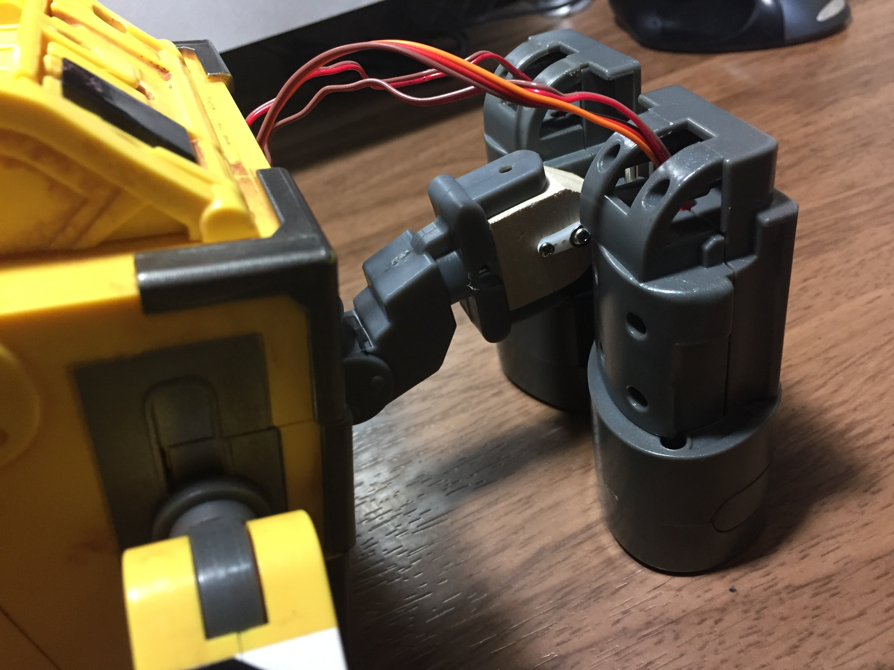

## Index

* [00_starting.md]()
* [01_caterpillar.md]()
* [02_speaker_radio.md]()
* [03_arms.md]()
* [04_wifi_eye_head.md]()
* [05_battery.md]()
