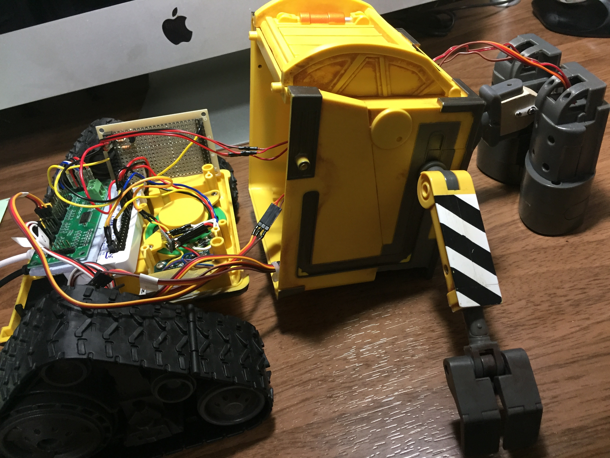

# WiFi

* It was replaced to RasPiZero W

# Power Switch

# Eye light

# Head

<blockquote class="twitter-tweet">
WALL-E自立制御プロジェクト、頭のサーボを50msec毎に数度動かすようにしてガックン！とならなくなった。 これで一通りの基本動作は実現できたので、次はセンサーと音声認識機能なんかを載せて行こうと思います。あと安いカメラがあれば使ってみたい。 <a href="https://t.co/LqouLpmkOq">pic.twitter.com/LqouLpmkOq</a>
&mdash; Nabeshin (@desmoquattro996) <a href="https://twitter.com/desmoquattro996/status/919899207221125122?ref_src=twsrc%5Etfw">October 16, 2017</a></blockquote> 

## Index

* [00. starting](00_starting.md)
* [01. caterpillar](01_caterpillar.md)
* [02. speaker_radio](02_speaker_radio.md)
* [03. arms](03_arms.md)
* [04. wifi_eye_head](04_wifi_eye_head.md)
* [05. battery](05_battery.md)
