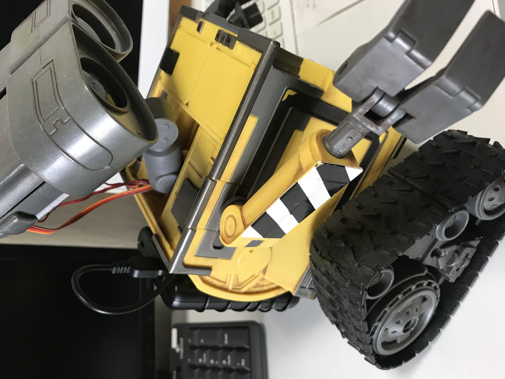

# RasPi WALL-E

## OverView


```
Command

    char* menuStr = "ウォーリー　そうさメニュー \n"
    " 1: 前に進む\n"
    " 2: 後ろに進む\n"
    " 3: 右に曲がる\n"
    " 4: 左に曲がる\n"
    " 5: 後ろを向く\n"
    " 6: Ohhh\n"
    " 7: WALL-E\n"
    " 8: ダンス\n"
    "10: 両手を挙げる\n"
    "11: 両手を下げる\n"
    "12: 右手を挙げる\n"
    "13: 右手を下げる\n"
    "14: 左手を挙げる\n"
    "15: 左手を下げる\n"
    "20: 右を見る\n"
    "21: 左を見る\n"
    "22: 前を見る\n"
    "23: 上を見る\n"
    "24: 下を見る\n"
    "25: 正面を見る\n"
    "26: YES\n"
    "27: NO\n"
    "30: 目のライトON\n"
    "31: 目のライトOFF\n"
    "50: 音楽を流す 1 (Dirty_Work)\n"
    "51: 音楽を流す 2 (Mark_Manson)\n"
    "52: 音楽を流す 3 (AC_DC)\n"
    "60: ラジオを流す AFN\n"
    " 0: 終わり\n"
    "番号を選んでください>";
```




## Compile & Run

* connect to RaspBerryPi Zero (W)
* install wiringPi package
* type following command

```
$ gcc main.c -o WALLE_Control_Zero.out -lwiringPi -lm
$ WALLE_Control_Zero.out
```

## Index

* [00_starting.md]()
* [01_caterpillar.md]()
* [02_speaker_radio.md]()
* [03_arms.md]()
* [04_wifi_eye_head.md]()
* [05_battery.md]()
